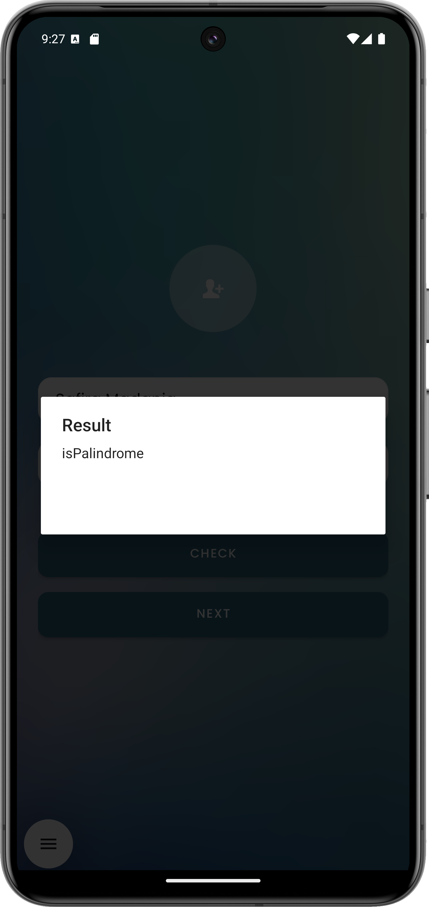

# 🚀 Suitmedia Android Technical Test

A simple Android application built for the Suitmedia internship technical test, developed using **Kotlin**, **Jetpack Compose**, and **MVVM architecture**.

---

## ✨ Features

- ✅ Input name & palindrome check  
- ✅ Navigate through screens  
- ✅ Choose a user from API  
- ✅ Display selected user  

---

## 📸 Screenshots

### 🟢 First Screen

**Default state:**  
 

**Empty name validation:**  
 

**Palindrome result (true):** 
 

**Palindrome result (false):** 
 

---

### 🟣 Second Screen

**Default state (after user input):**  
 

**After choosing a user:**  
 

---

### 🟡 Third Screen

**User list fetched from API, shown after clicking the "Choose a User" button:**  
 

---

## 🧱 Tech Stack

- **Kotlin**
- **Jetpack Compose**
- **MVVM**
- **Retrofit** for network/API
- **Material Components**
- **ViewModel + LiveData**

---

## ⚙️ Setup & Run

1. Clone repository
2. Open in Android Studio
3. Run on emulator/device (min SDK 21)

---

## ✍️ Author

Safira Madania – [GitHub](https://github.com/safiramadania)

---

